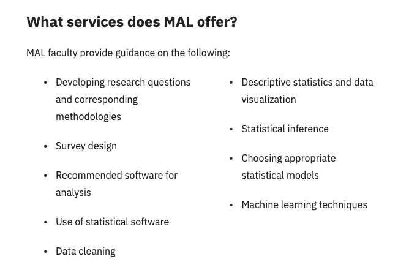

## Visualizing Correlation

We're going to install and load the `corrplot` and `usdata` packages. Let's also load the `tidyverse`.

```{r}
# install.packages("corrplot", "usdata")
library(corrplot)
library(usdata)
library(tidyverse)
```

## County Dataset

There is a `county` dataset inside the usdata package that we want to use. Let's take a look at the variables.

```{r}
summary(county)
```

## Correlation

We only want numeric variables for our correlation plot so let's create a new object.

```{r}
county_numeric <- county |> 
  select_if(is.numeric)

head(county_numeric)
```

## Correlation

There are many different ways to obtain correlation in R. The most basic is the `cor` function from Base R

```{r}
cor(county_numeric, use = "complete.obs")
```

## Visualizing Correlation

```{r}
corrplot(cor(county_numeric, use = "complete.obs"), method = "pie", 
         type = "upper")
```

## Exercise: Make a Correlation Plot

Look at the help menu for the `corrplot` function and change the method argument to something other than "pie".

```{r}
#| echo: TRUE
#| eval: FALSE
corrplot(cor(county_numeric, use = "complete.obs"), method = "?", 
         type = "upper")
```

## Next: Interactions

We're going to explore a relatively new R package called `interactions`. You can find details at interactions.jacob-long.com. The creator of this package is a faculty member at University of South Carolina.

```{r}
# install.packages("interactions")
library(interactions)
```

## What is an interaction?

An interaction is when a predictor's (X) effect on the outcome (Y) varies based on the values of another predictor (Z) in your model.<br><br> In other words, X's effect on Y is contingent on Z.<br><br> An interaction is also refered to as a moderated relationship.

## Regression with an Interaction

Outcome: Unemployment Rate<br><br> Predictors: Homeownership, Median Education, and the interaction between the two predictors

```{r}
modelA <- lm(unemployment_rate ~ homeownership + median_edu + 
               homeownership:median_edu, data = county)

levels(county$median_edu) # keep this is mind
```

## Regression with an Interaction

```{r}
summary(modelA) 
```

## Output from Interaction Package

```{r}
sim_slopes(modelA, pred = homeownership, modx = median_edu)
```

## Visualizing the Interaction

Why does this look insane?

```{r}
interact_plot(modelA, pred = homeownership, modx = median_edu, interval = TRUE)
```

## This is why...

```{r}
fct_count(county$median_edu)
```

## Yikes. Deal with that Factor

We're going to continue working with the county dataset but first we need contend with that factor level issue.

```{r}
# There are only two counties (out of 3K) 
# with a median education less than high school. 
# We're going to merge the "below_hs" level with "hs_diploma"

county$median_edu <- fct_collapse(county$median_edu, 
                                  high_school = c("hs_diploma", "below_hs"))

levels(county$median_edu)
```

## Regression Model Round 2

Now we're going to run the regression with the updated factor.

```{r}
modelB <- lm(unemployment_rate ~ homeownership + median_edu + 
               homeownership:median_edu, data = county)

levels(county$median_edu) # keep this is mind
```

## Do we still have an interaction?

```{r}
summary(modelB) 
```

## Simple Slopes

```{r}
sim_slopes(modelB, pred = homeownership, modx = median_edu)
```

## Visualizing the Interaction

Any better?

```{r}
interact_plot(modelB, pred = homeownership, modx = median_edu, 
              interval = TRUE)
```

## Categorical (Factor) Predictors

What if we had an interaction between two categorical predictors?

```{r}
modelC <- lm(unemployment_rate ~ metro + median_edu + 
               metro:median_edu, data = county)

levels(county$metro)
```

## Model Summary

```{r}
summary(modelC)
```

## Let's visualize our relationships

Change the function to `cat_plot` when both the predictor and moderator are categorical.

## Visualizing the (non) Interaction

```{r}
cat_plot(modelC, pred = median_edu, modx = metro)
```

## Regression Modeling in R

What we covered in Four Weeks:

`Week 1`: linear regression with lm(), anova(), CIs, fitted values, residuals, outliers <br> `Week 2`: multiple regression, setting up interactions, categorical predictors \| factors \| ref levels <br> `Week 3`: logistic regression with glm(), log odds \| ORs \| probabilities, estimated marginal means <br> `Week 4`: correlation plots, significant interactions, simple slopes analysis

## More Statistics?!



## Submit a [Methods and Analysis Lab](https://libraries.olemiss.edu/services/methods-and-analysis-lab/) Consultation. It's free and we're friendly!

## Final Workshop Series Feedback

You can always email me at `slkelly@olemiss.edu` or `slkelly@go.olemiss.edu`

Thank you for participating in `Regression Modeling with R`!
